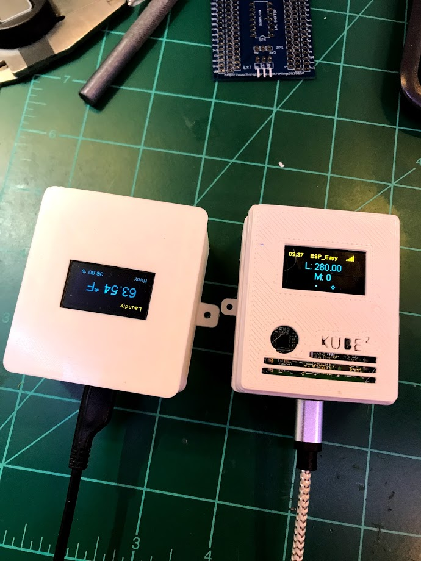
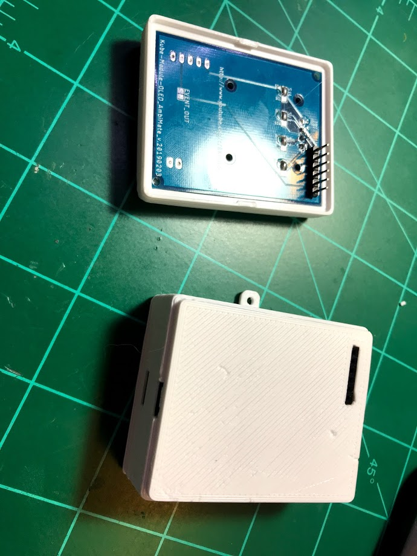
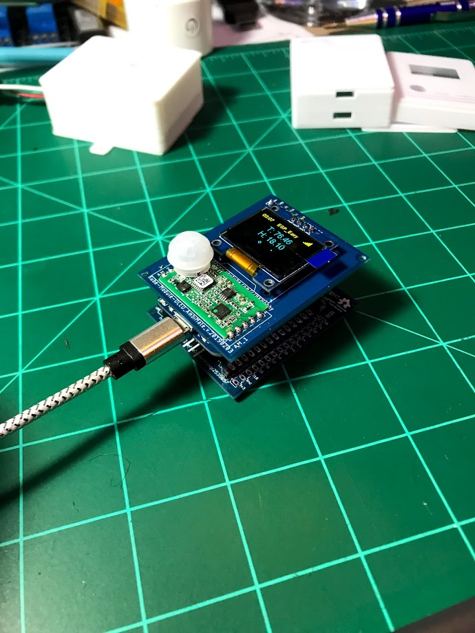

# KubeSensor
Repository for the Kube home automation multi sensor platform

## Description

The Kube V2 builds on the previous [design](https://www.thingiverse.com/thing:2539897), incorporating improvements to modularity, support for additional sensors, and building ease.

    

##### Original Kube (left) and Kube V2 (right)

The main design improvement for Kube V2 is that all components are installed on dedicated PCBs, removing the need for wiring, and the PCBs are connected to each other via long headers, which allow the different "modules" to snap together to form a complete Kube.

##### OLED module (top) with male headers that snap into the base board (bottom) with tabs on the 3d printed enclosures holding the module in place

The 6-pin header is populated with I2C signals from the NodeMCU (D1/D2), D4 pin for LED control, and 5V and 3V3 power supply pins with ground. This allows building various different designs of the "stack", and future expansion of the Kube platform, via I2C connected "submodules". The design currently contains four modules, including:

1. Base module (with NodeMCU, breakout headers, 74HCT125N level shifter and external connectors/spots for DHT22 sensor)
2. Power Supply module (with AC/DC, DC/DC and POE-level power supply options, to provide the 5V power for the stack)
3. Analog/Digital IO module (offering expansion of Digital I/O up to 128 signals and 4 channels of 16-bit ADC analog)
4. OLED/AmbiMate sensor module (offering a 0.96" OLED screen for local sensor data display and support for the multiple sensor AmbiMate MS4 board from TE Connectivity)

##### Kube stack with boards 1 (Base Module) and 4 (OLED/AmbiMate) shown, comprising a multi sensor

The different boards can be stacked in any order (with OLED board on top, of course), and multiple ADIO boards can be stacked together to expand I/O up to 128 channels.

The Kube v2 supports typical ESP8266 firmwares, including [ESPEasy](https://www.letscontrolit.com/wiki/index.php?title=ESPEasy), as well as my original Kube [firmware](https://github.com/bkpsu/NodeMCU-Home-Automation-Sensor) firmware (with minor changes for pin layout). With ESPEasy, the different sensors and OLED screen can be easily connected to home automation platofrms like [openHAB](https://www.openhab.org) or [HomeAssistant](https://www.home-assistant.io/) via MQTT.

---

## Boards

This section will describe the currently available Kube module boards in detail, including schematics and any jumper settings required for each board, as well as links to the parts required to build each module.

### 1. Kube Base Module

The Kube Base module is the only **required** board in the Kube stack. It contains the headers for a [NodeMCU](https://amzn.to/2l9GGET) v0.9, v2 (LoLin v3 works, but won't fit the enclosure), as well as breakout headers for all of the NodeMCU pins. With just the Kube Base module, a NodeMCU, a DHT22 sensor, and an OLED screen, you can create [this sensor](https://www.thingiverse.com/thing:2539897):

The base module contains the following features/headers:

TOP: (NodeMCU side)

|Device|Usage|Notes|
|:--------|:-----|-------|
|EXT|Used for external sensor connections, e.g. [HC-SR501](https://amzn.to/2l9G0zl) PIR motion sensor (D5 NodeMCU pin)|VCC pin is tied to JP1|
|JP1|Selects 5V or 3.3V supply voltage for the EXT header|Does *not* affect D5 voltage range|
|IC1|[74HCT125N](https://amzn.to/2l9FBwP) 4-channel fast level shifter|Used for I2C/LED and EXT signal pins; Great for LED pixels|
|D1|[BAT43](https://amzn.to/2jFCRqv) Schottky Diode|Used between RST and D0 pins on the NodeMCU to prevent boot-up issues during flashing|
|DHT|[DHT22](https://amzn.to/2l98yZL) Temperature/Humidity sensor|Used when base baord is used as a remote temperature/humidity sensor; uses D6 pin on NodeMCU|
|I2C/LED|I2C bus connector header, to allow *daughter-boards* to connect to the Kube base board|Has both 5V and 3.3V pins, GND, SCL (D1) and SDA (D2), as well as an additional digital I/O pin (D4), commonly used in LED strip controller firmware|

BOTTOM:

|Device|Usage|Notes|
|:--------|:-----|-------|
|D1BYP, D2BYP|Used to shift (to 5V via IC1) or bypass (3.3V from the NodeMCU) the I2C Clock (D1, SCL) and Data (D2, SDA) pins within the I2C/LED header|Solder middle pad to either the SHFT (for 5V) or BYP (for 3.3v) pads.|
|D4BYP|Used to shift (to 5V via IC1) or bypass (3.3V from the NodeMCU) the D4 LED pin within the I2C/LED header|Solder middle pad to either the SHFT (for 5V) or BYP (for 3.3v) pads.|
|D5BYP|Used to shift (to 5V via IC1) or bypass (3.3V from the NodeMCU) the D5 EXT pin within the EXT sensor header|Solder middle pad to either the SHFT (for 5V) or BYP (for 3.3v) pads.|

The full schematic for the Kube baseboard is shown below: 

### 2. Power Supply Module

The full schematic for the Kube Power Supply submodule is shown below:

### 3. Analog/Digital I/O module

The full schematic for the Kube IO submodule is shown below:

### 4. OLED/AmbiMate MS4 module

The full schematic for the Kube OLED/AmbiMate submodule is shown below:

---

## Software

Use [ESPEasy](https://www.letscontrolit.com/espeasy/) firmware to easily connect the different sensors to the NodeMCU, and send them to your favorite databse, or home automation program.

---

## BOM

Full, up to date BOM is available [here](Kube_V2_BOM.xlsx).

Get the PCB Boards directly from [PCBWay](https://www.pcbway.com/project/member/?bmbno=74C10494-455E-47)!